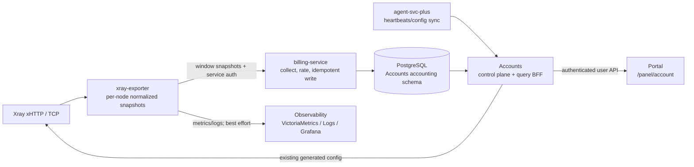

# 架构与契约设计

## 1. 范围与非目标

本功能增加“用户可见的网络用量、配额、节点健康与账单摘要”。它不重写现有控制面。

| 包含 | 不包含 |
| --- | --- |
| Xray 用户流量采集、标准化、计量、配额展示 | 修改 Xray 协议、入站、证书或路由生成逻辑 |
| 节点健康/负载的用户可见摘要 | 用 Prometheus/VictoriaMetrics 直接结算用户账单 |
| Accounts 面向 Portal 的只读聚合 API | Portal 直连数据库或内部运维端点 |
| UAT 多节点来源与幂等重放 | 修改既有 Stripe webhook 或登录/MFA 流程 |

## 2. 目标架构



`xray-exporter -> Billing` 是计费主路径；`xray-exporter -> Observability` 是旁路。两者互不依赖：Observability 故障只触发告警，不能让 `collect-and-rate` 失败；Billing 故障不能让 Xray、Agent 或用户登录停止工作。

## 3. 组件职责与边界

| 组件 | 新增职责 | 明确不负责 |
| --- | --- | --- |
| Xray | 按既有 UUID 产生累计上下行计数 | 计费、配额、Portal 查询 |
| xray-exporter | 轮询 Xray，按节点输出可分页 snapshot；暴露运行指标 | 评率、扣配额、用户权限决策 |
| Observability | 保存指标/日志、看板、告警 | 用户账单真相、Portal 用户级查询 |
| billing-service | 读取 snapshot window、去重、计算 delta、写用量/账本/配额 | 用户认证、Xray 配置生成、对外 UI API |
| PostgreSQL | 保存账务事实与检查点 | 替代 Exporter 实时指标 |
| Accounts | 保持用户、订阅、Xray 控制面；聚合只读用户视图 | 重新评率或二次扣减 |
| Portal | 在既有账号面板展示 Accounts 返回的数据 | 调用内部 Billing/Exporter/Observability |

## 4. UAT 服务与路由地图

| 领域 | 服务 | UAT 入口/连接 |
| --- | --- | --- |
| web-saas | Portal / Console | `https://console-uat.onwalk.net` |
| web-saas | Accounts | `https://accounts-uat.onwalk.net` |
| agent-proxy | Agent Proxy / Xray | `https://agent-proxy.onwalk.net` |
| agent-proxy | xray-exporter | 仅节点本地监听；Billing 使用受保护的内部地址 |
| web-saas | billing-service | 仅内部网络；不配置公网 Caddy 路由 |
| web-saas | PostgreSQL | `stunnel-client:15432`，不暴露给 Portal |
| open-platform | Observability | `https://observability.svc.plus`；只接收遥测与运维访问 |

UAT 发布使用同一不可变 `daily-build-YYYY.MM.DD-rN` snapshot。当前 compose UAT 文件中的 `latest` 必须在上线前替换为该 snapshot 或完整 digest；不同仓库不能各自漂移。

## 5. 数据契约

### 5.1 Exporter snapshot

Billing 只消费窗口化 API，不以 metrics scrape 或 `latest` 响应做计费。推荐请求：

```text
GET /v1/snapshots/window?since=<RFC3339>&until=<RFC3339>&limit=<n>&cursor=<token>
Authorization: Bearer <per-source token>
```

每条 sample 至少包含：

```json
{
  "collected_at": "2026-08-01T10:00:00Z",
  "node_id": "agent-proxy.onwalk.net",
  "env": "uat",
  "uuid": "user-proxy-uuid",
  "email": "optional@example.invalid",
  "inbound_tag": "xhttp-in",
  "uplink_bytes_total": 123456,
  "downlink_bytes_total": 654321
}
```

约束：

- `node_id` 与 `env` 必须匹配 Billing source 配置；不匹配整页拒绝并告警。
- 计数是单调累计值；回退或 Xray 重置由 `reset_epoch`/检查点规则处理，不得产生负用量。
- `uuid` 是用户关联键；未知、已删除或暂停用户不创建新账号，只记录可观测错误计数。
- exporter 保存至少 72 小时窗口数据；UAT 中 Billing 允许中断后回补。

### 5.2 PostgreSQL 事实表与写入权

| 表 | 写入者 | 读取者 | 目的 |
| --- | --- | --- | --- |
| `traffic_stat_checkpoints` | Billing | Billing | 每节点/用户累计计数检查点 |
| `traffic_minute_buckets` | Billing | Accounts、Billing | 分钟级、可聚合用量事实 |
| `billing_ledger` | Billing | Accounts、财务工具 | 评率后的账本记录 |
| `account_quota_states` | Billing 消耗字段；Accounts 重置权益字段 | Accounts、Billing | 剩余配额与欠费/暂停状态 |
| `account_billing_profiles` | Accounts/Stripe entitlement | Billing、Accounts | 套餐与评率配置 |
| `billing_source_sync_state` | Billing | Billing、运维 | 每来源同步水位和错误 |

字段权责：Accounts 只在订阅变更、付款成功时重置权益；Billing 只推进使用量、剩余额度与账本。任何一次 `collect-and-rate` 必须在单个数据库事务中更新 checkpoint、minute bucket、ledger、quota state 和 source watermark。

### 5.3 幂等与重放

1. Billing 按 `(source_id, node_id, uuid, bucket_start)` 计算 delta。
2. `traffic_minute_buckets` 唯一键防止同一窗口重复插入。
3. `billing_source_sync_state.last_completed_until` 仅在整个窗口事务提交后推进。
4. 来源错误、未知 UUID 或 node/env 不匹配不推进水位；可在修复后重放。
5. 负 delta 视为计数器 reset：建立新 epoch/checkpoint，当前 bucket 记为零或按明确 reset 规则处理，绝不回冲已有账本。

## 6. 内部 API 设计

Portal 仅调用 Accounts。所有用户 API 复用当前 session/JWT 鉴权和“只能读取本人数据”的授权逻辑。

### 6.1 Accounts → Portal

```text
GET /api/account/usage/summary
GET /api/account/usage/timeseries?from=<RFC3339>&to=<RFC3339>&granularity=hour|day
GET /api/account/billing/summary
GET /api/account/nodes
GET /api/account/audit?cursor=<opaque>&limit=<1..50>
```

`GET /api/account/usage/summary` 返回：

```json
{
  "accountUuid": "...",
  "includedQuotaBytes": 1099511627776,
  "usedBytes": 751619276800,
  "remainingBytes": 347893350976,
  "usagePercent": 68.36,
  "periodStart": "2026-08-01T00:00:00Z",
  "periodEnd": "2026-09-01T00:00:00Z",
  "lastRatedAt": "2026-08-01T10:00:00Z",
  "dataFreshness": "fresh",
  "sourceOfTruth": "postgresql"
}
```

`GET /api/account/nodes` 以 Accounts Agent 心跳为在线真相，以 Observability 汇总为可选展示增强。若遥测不可用，仍返回节点、协议、最后心跳和配置状态，并标记 `telemetryStatus: unavailable`。

### 6.2 Billing 运维 API

Billing 现有 `/v1/status`、`/healthz`、`/v1/jobs/collect-and-rate` 保持不变。新增以下接口仅限服务身份或管理员，不通过 Portal 暴露：

```text
GET /v1/usage/summary?account_uuid=<uuid>
GET /v1/usage/timeseries?account_uuid=<uuid>&from=&to=&granularity=
GET /v1/ledger?account_uuid=<uuid>&cursor=&limit=
```

Accounts 可以在迁移期调用这些接口，但目标状态是优先从共享 PostgreSQL 的只读 repository 聚合，避免把 Billing 变成用户查询的单点依赖。

## 7. Observability 契约

Exporter、Billing 与 Accounts 增加下列遥测；标签禁止携带 email、完整 UUID、访问 token 等高基数/敏感信息。用户维度只留在 PostgreSQL。

| 指标 | 标签 | 用途 |
| --- | --- | --- |
| `xray_exporter_snapshot_success_total` | `node_id,env,protocol` | 采集成功率 |
| `xray_exporter_snapshot_age_seconds` | `node_id,env` | 数据新鲜度告警 |
| `xray_node_active_clients` | `node_id,env,inbound_tag` | 节点容量 |
| `xray_node_traffic_bytes_total` | `node_id,env,direction` | 节点趋势，非计费 |
| `billing_collect_success_total` | `source_id,env` | 计费任务成功率 |
| `billing_collect_lag_seconds` | `source_id,env` | 水位延迟 |
| `billing_collect_error_total` | `source_id,reason` | 失败分类 |
| `accounts_usage_query_error_total` | `endpoint,reason` | 用户查询质量 |

告警：snapshot age 超过 5 分钟为 warning、超过 15 分钟为 critical；Billing watermark 超过 10 分钟未推进为 warning。告警只通知运维，不改变用户 Xray 配置和登录状态。

## 8. Portal UI 设计

保留 `/panel/account` 路由、侧边栏、MFA、二维码和订阅管理组件。允许调整页面为以下布局：

```text
账号与订阅
├─ 套餐与续费卡               现有订阅功能
├─ 流量配额卡（新增）         已用/剩余/重置日期/数据新鲜度
├─ 节点连接卡（扩展）         现有二维码 + 当前节点健康摘要
├─ 流量趋势（新增）           最近 7/30 天，来自 Accounts timeseries
├─ 账单摘要（扩展）           最近评率记录与欠费/暂停状态
└─ 账户安全（保留）           OIDC、MFA、最近登录
```

兼容规则：

- 新 API 失败时只让对应卡片显示“暂不可用/最后成功时间”，不得影响二维码、订阅或账户安全区块。
- 无用量的用户显示零值与引导文案，不展示错误。
- 帐户暂停只展示状态；Xray 排除用户仍由现有 Accounts → Agent config sync 完成。
- 所有数量格式化在 Portal 中进行，但原始 byte/时间字段由 Accounts 提供。

## 9. 安全与访问控制

- Exporter 监听本机或私网，Billing 采用每 source 独立 token；跨节点目标状态使用 mTLS，拒绝 `skip-verify`。
- token、证书、数据库连接均由 Vault OIDC 注入；不写入 Git、镜像层或浏览器。
- Portal 不接受 `account_uuid` 请求参数来查询其他用户；Accounts 从 session 推导主体。
- 管理员跨用户查询使用单独 `/api/admin/...` 路径、审计事件和显式 RBAC。
- 保留原始 UUID 仅在 Exporter/Billing/Accounts 内部；日志和 metrics 使用哈希或节点级聚合标签。

## 10. 兼容性与故障隔离矩阵

| 故障 | 用户连接/Xray | Billing 事实 | Portal | 运维动作 |
| --- | --- | --- | --- | --- |
| Observability 不可用 | 不受影响 | 不受影响 | 显示上次遥测/不可用 | 告警并修复旁路 |
| Exporter 不可用 | 不受影响 | 暂停推进，可回补 | 显示 `stale` | 告警；恢复后重放窗口 |
| Billing 不可用 | 不受影响 | 暂停推进，可回补 | 显示最近已结算数据 | 恢复服务并重跑任务 |
| PostgreSQL 不可用 | Accounts/Billing 受影响，Xray 保持当前配置 | 不可写 | 数据卡片失败 | 按数据库故障流程处理 |
| Accounts 不可用 | 既有控制面受影响 | 可按策略暂停任务 | Portal 认证/数据受影响 | 保持现有 HA/恢复策略 |
